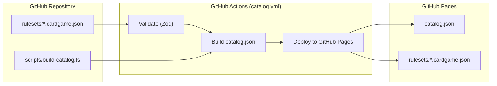
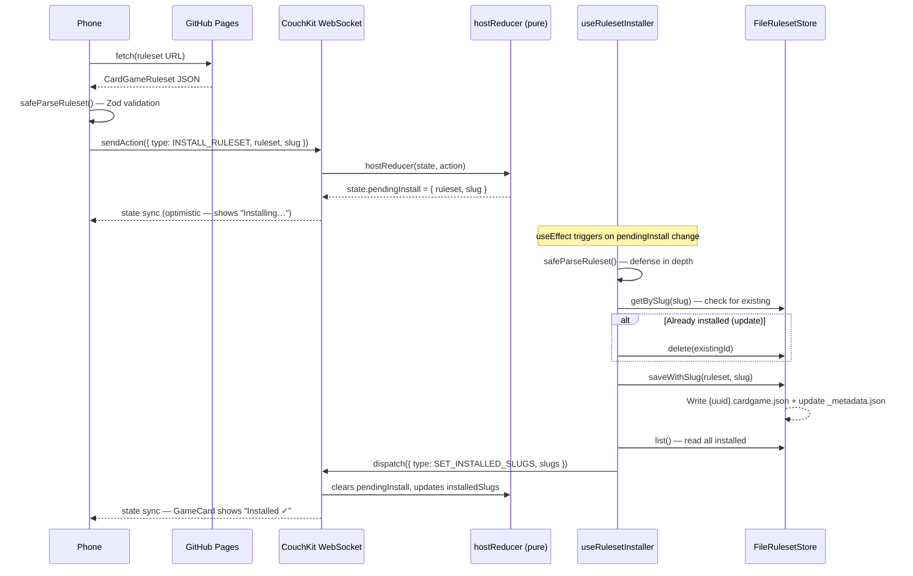
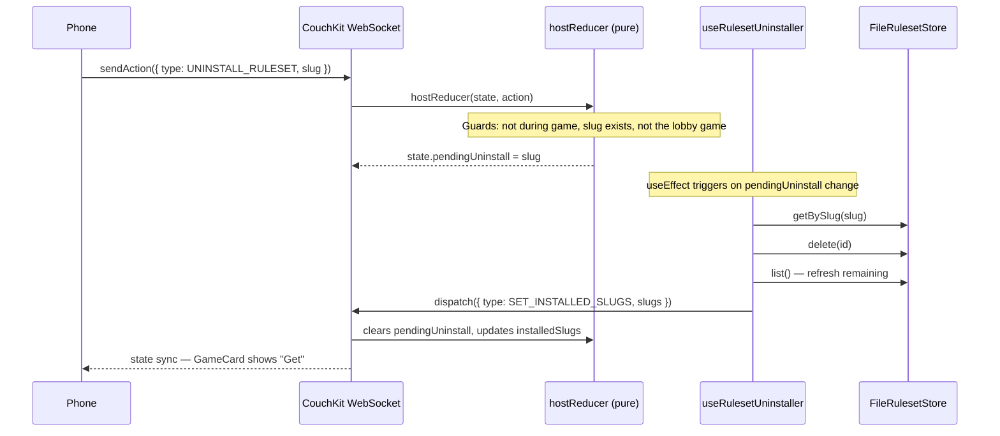
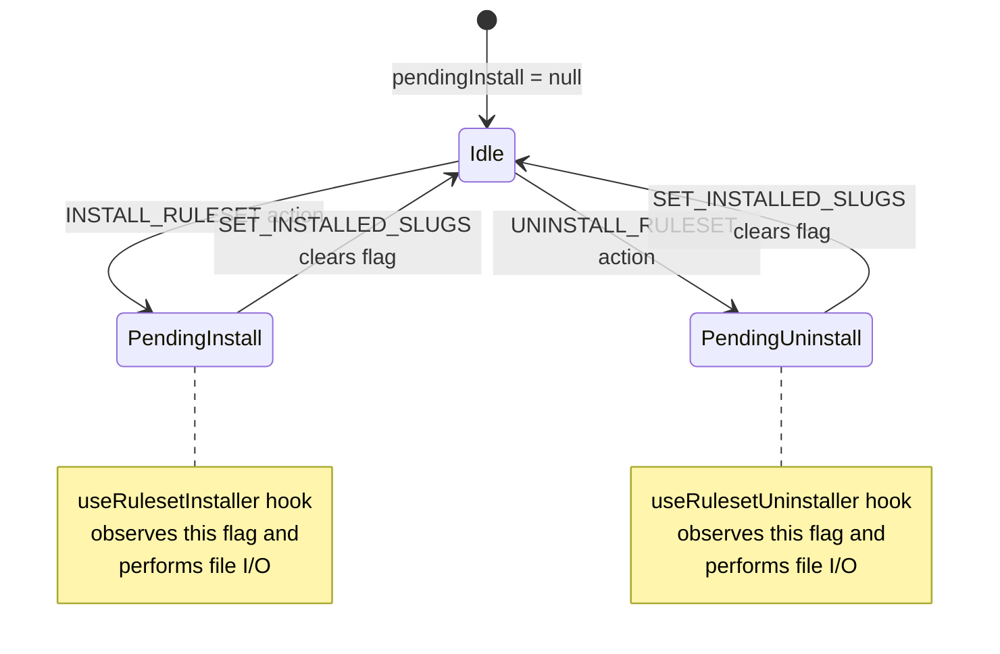

# Catalog & Ruleset Import Architecture

How rulesets travel from source files to the TV's filesystem — and how phones interact with the catalog.

## Pipeline Overview



## Install Flow

When a phone user taps "Get" on a game card:



## Uninstall Flow



## Transient Flag Pattern

The reducer is **pure** — no side effects allowed. File I/O happens in host-side React hooks that observe transient flags in state:



## TV Filesystem Layout

```
${Paths.document}/rulesets/
├── _metadata.json              ← { [uuid]: { slug, importedAt, lastPlayedAt } }
├── a1b2c3d4.cardgame.json     ← full ruleset JSON
├── e5f6g7h8.cardgame.json     ← another ruleset
└── ...
```

Managed by `FileRulesetStore` in `packages/host/src/storage/file-ruleset-store.ts`.

## Boot-Time Sync

On TV app launch, `useInstalledSlugs` reads all rulesets from disk and dispatches `SET_INSTALLED_SLUGS` — seeding the CouchKit state so connected phones know what's installed.

## Offline Behavior

| Scenario | Works? | Why |
|----------|--------|-----|
| Play an installed game (TV + phones on WiFi) | ✅ | Entirely local — CouchKit syncs over LAN |
| TV boots with installed games | ✅ | Reads from disk, no internet needed |
| Built-in rulesets (Blackjack) | ✅ | Bundled in APK at build time |
| Browse catalog from phone | ❌ | Requires GitHub Pages fetch |
| Install new game from phone | ❌ | Requires GitHub Pages for ruleset download |
| Phone on WiFi but no internet | ⚠️ | Can connect to TV and play installed games, but cannot browse or install |

## Key Files

| File | Role |
|------|------|
| `scripts/build-catalog.ts` | Generates catalog.json from rulesets |
| `packages/shared/src/bridge/host-reducer.ts` | Pure reducer — sets transient flags |
| `packages/client/src/hooks/useCatalog.ts` | Fetches catalog from GitHub Pages |
| `packages/client/src/screens/CatalogScreen.tsx` | Full catalog browser (ruleset_picker status) |
| `packages/client/src/screens/LobbyScreen.tsx` | Lobby catalog browser (lobby status) |
| `packages/client/src/components/GameCard.tsx` | Install/update/remove UI |
| `packages/host/src/hooks/useRulesetInstaller.ts` | Watches pendingInstall → file I/O |
| `packages/host/src/hooks/useRulesetUninstaller.ts` | Watches pendingUninstall → file I/O |
| `packages/host/src/hooks/useInstalledSlugs.ts` | Boot-time disk → state sync |
| `packages/host/src/hooks/useRulesetStore.ts` | Reactive store for TV picker UI |
| `packages/host/src/storage/file-ruleset-store.ts` | File-based CRUD on Android TV |
