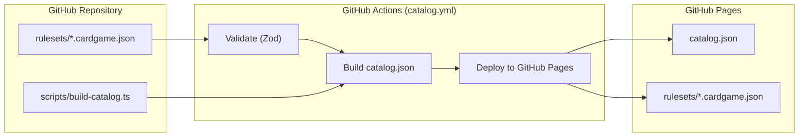
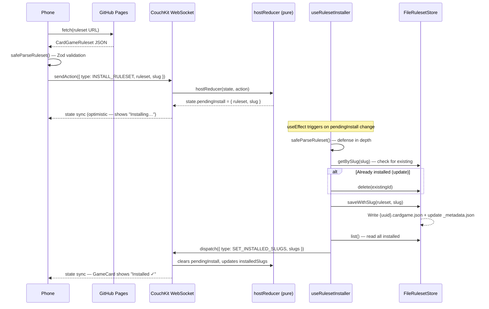
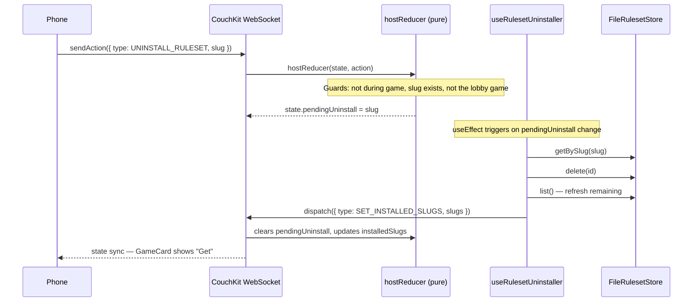
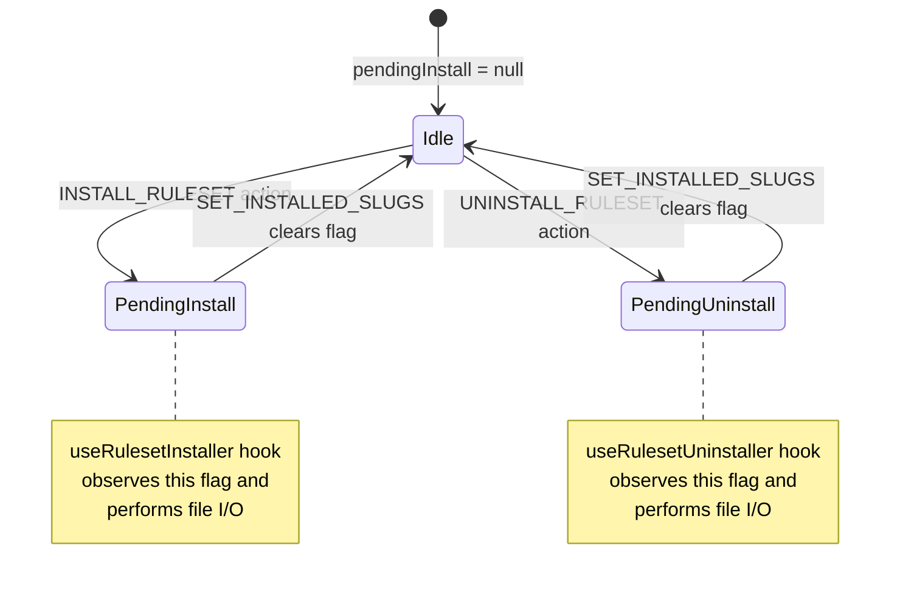

# Catalog & Ruleset Import Architecture

How rulesets travel from source files to the TV's filesystem — and how phones interact with the catalog.

## Pipeline Overview


```mermaid
flowchart LR
    subgraph Repo["GitHub Repository"]
        R["rulesets/*.cardgame.json"]
        S["scripts/build-catalog.ts"]
    end

    subgraph CI["GitHub Actions (catalog.yml)"]
        V["Validate (Zod)"]
        B["Build catalog.json"]
        D["Deploy to GitHub Pages"]
    end

    subgraph Pages["GitHub Pages"]
        C["catalog.json"]
        F["rulesets/*.cardgame.json"]
    end

    R --> V --> B --> D
    S --> B
    D --> C
    D --> F
```

## Install Flow

When a phone user taps "Get" on a game card:


```mermaid
sequenceDiagram
    participant Phone
    participant Pages as GitHub Pages
    participant CK as CouchKit WebSocket
    participant Reducer as hostReducer (pure)
    participant Hook as useRulesetInstaller
    participant Disk as FileRulesetStore

    Phone->>Pages: fetch(ruleset URL)
    Pages-->>Phone: CardGameRuleset JSON

    Phone->>Phone: safeParseRuleset() — Zod validation

    Phone->>CK: sendAction({ type: INSTALL_RULESET, ruleset, slug })
    CK->>Reducer: hostReducer(state, action)
    Reducer-->>CK: state.pendingInstall = { ruleset, slug }
    CK-->>Phone: state sync (optimistic — shows "Installing…")

    Note over Hook: useEffect triggers on pendingInstall change

    Hook->>Hook: safeParseRuleset() — defense in depth
    Hook->>Disk: getBySlug(slug) — check for existing
    alt Already installed (update)
        Hook->>Disk: delete(existingId)
    end
    Hook->>Disk: saveWithSlug(ruleset, slug)
    Disk-->>Disk: Write {uuid}.cardgame.json + update _metadata.json
    Hook->>Disk: list() — read all installed
    Hook->>CK: dispatch({ type: SET_INSTALLED_SLUGS, slugs })
    CK->>Reducer: clears pendingInstall, updates installedSlugs
    CK-->>Phone: state sync — GameCard shows "Installed ✓"
```

## Uninstall Flow


```mermaid
sequenceDiagram
    participant Phone
    participant CK as CouchKit WebSocket
    participant Reducer as hostReducer (pure)
    participant Hook as useRulesetUninstaller
    participant Disk as FileRulesetStore

    Phone->>CK: sendAction({ type: UNINSTALL_RULESET, slug })
    CK->>Reducer: hostReducer(state, action)
    Note over Reducer: Guards: not during game, slug exists, not the lobby game
    Reducer-->>CK: state.pendingUninstall = slug

    Note over Hook: useEffect triggers on pendingUninstall change

    Hook->>Disk: getBySlug(slug)
    Hook->>Disk: delete(id)
    Hook->>Disk: list() — refresh remaining
    Hook->>CK: dispatch({ type: SET_INSTALLED_SLUGS, slugs })
    CK->>Reducer: clears pendingUninstall, updates installedSlugs
    CK-->>Phone: state sync — GameCard shows "Get"
```

## Transient Flag Pattern

The reducer is **pure** — no side effects allowed. File I/O happens in React hooks (shared by the TV host and the browser display via `packages/host-core/src/ruleset-hooks.ts`) that observe transient flags in state:


```mermaid
stateDiagram-v2
    [*] --> Idle: pendingInstall = null

    Idle --> PendingInstall: INSTALL_RULESET action
    PendingInstall --> Idle: SET_INSTALLED_SLUGS clears flag

    Idle --> PendingUninstall: UNINSTALL_RULESET action
    PendingUninstall --> Idle: SET_INSTALLED_SLUGS clears flag

    note right of PendingInstall
        useRulesetInstaller hook
        observes this flag and
        performs file I/O
    end note

    note right of PendingUninstall
        useRulesetUninstaller hook
        observes this flag and
        performs file I/O
    end note
```

## TV Filesystem Layout

```
${Paths.document}/rulesets/
├── _metadata.json              ← { [uuid]: { slug, importedAt, lastPlayedAt } }
├── a1b2c3d4.cardgame.json     ← full ruleset JSON
├── e5f6g7h8.cardgame.json     ← another ruleset
└── ...
```

Managed by `FileRulesetStore` in `packages/host/src/storage/file-ruleset-store.ts`.

## Boot-Time Sync

On TV app launch, `useInstalledSlugs` reads all rulesets from disk and dispatches `SET_INSTALLED_SLUGS` — seeding the CouchKit state so connected phones know what's installed.

## Offline Behavior

| Scenario | Works? | Why |
|----------|--------|-----|
| Play an installed game (TV + phones on WiFi) | ✅ | Entirely local — CouchKit syncs over LAN |
| TV boots with installed games | ✅ | Reads from disk, no internet needed |
| Built-in rulesets (Crazy Eights) | ✅ | Bundled at build time (`packages/host-core/src/built-in-rulesets.ts`) |
| Browse catalog from phone | ❌ | Requires GitHub Pages fetch |
| Install new game from phone | ❌ | Requires GitHub Pages for ruleset download |
| Phone on WiFi but no internet | ⚠️ | Can connect to TV and play installed games, but cannot browse or install |

## Key Files

| File | Role |
|------|------|
| `scripts/build-catalog.ts` | Generates catalog.json from rulesets |
| `packages/shared/src/bridge/host-reducer.ts` | Pure reducer — sets transient flags |
| `packages/client/src/hooks/useCatalog.ts` | Fetches catalog from GitHub Pages |
| `packages/client/src/screens/CatalogScreen.tsx` | Full catalog browser (ruleset_picker status) |
| `packages/client/src/screens/LobbyScreen.tsx` | Lobby catalog browser (lobby status) |
| `packages/client/src/components/GameCard.tsx` | Install/update/remove UI |
| `packages/host-core/src/ruleset-hooks.ts` | `useRulesetInstaller` (pendingInstall → store I/O), `useRulesetUninstaller` (pendingUninstall → store I/O), `useInstalledSlugs` (boot-time store → state sync) |
| `packages/host-core/src/use-ruleset-store.ts` | `useRulesetStore` — reactive store for the picker UI |
| `packages/host-core/src/ruleset-store.ts` | `RulesetStore` interface the hooks write through |
| `packages/host-core/src/built-in-rulesets.ts` | Rulesets bundled into the app (Crazy Eights) |
| `packages/host/src/storage/file-ruleset-store.ts` | File-based `RulesetStore` on Android TV |
